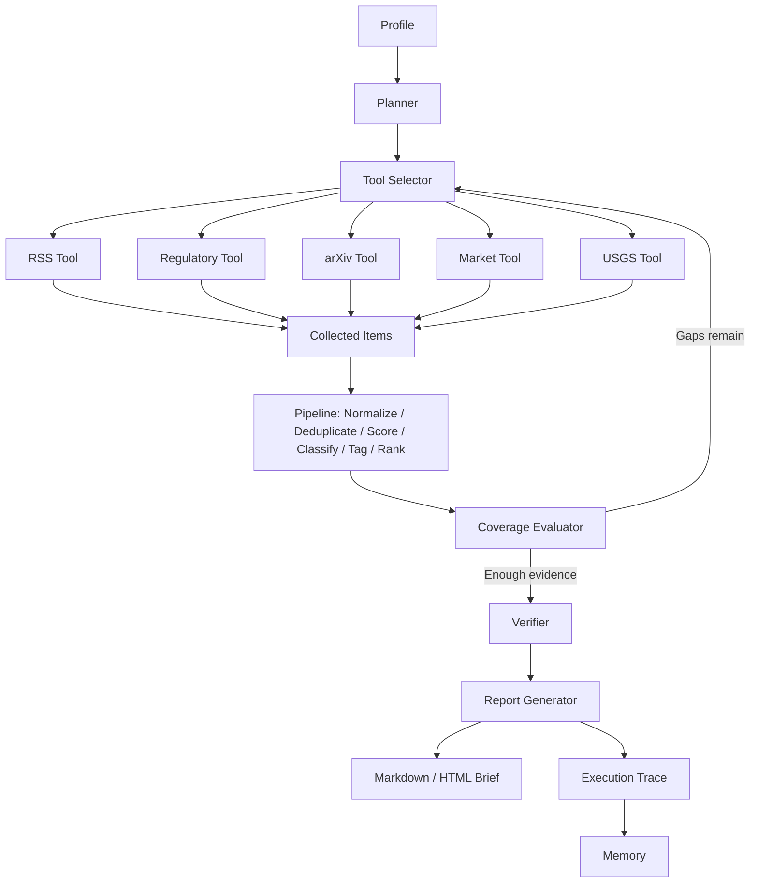

# RiskLens AI: Risk-Aware Market & Technology Intelligence Agent


RiskLens AI is a controlled, tool-using intelligence agent for financial services, FinTech/Web3 risk, and AI technology strategy use cases.

It combines a deterministic risk intelligence pipeline with an auditable agentic orchestration layer. The pipeline handles ingestion, normalization, deduplication, source reliability scoring, topic classification, risk tagging, evidence quality scoring, severity/urgency classification, ranking, and report generation. The agentic layer adds profile-specific planning, tool selection, coverage evaluation, retry logic, lightweight memory, verification, and execution traces.

RiskLens AI does not provide investment advice, trading recommendations, or autonomous financial decisions. It is designed for public-source intelligence analysis, risk monitoring, and executive briefing generation.

## Coverage Areas

- Financial services and digital transformation
- FinTech, Web3, and risk data analysis
- AI application automation
- Data analytics and business intelligence
- Risk monitoring and RegTech

## Pipeline Mode vs Agent Mode

- `run`: deterministic pipeline mode. It collects or loads items, runs the risk intelligence pipeline, and generates English and Chinese reports.
- `agent-run`: controlled agentic orchestration mode. It creates a profile-specific plan, selects tools, evaluates coverage gaps, retries within a fixed iteration limit, verifies evidence, saves reports, writes memory, and creates an execution trace.

## Architecture



## Quick Start on Windows

Open PowerShell, then run the commands below from the folder that contains `RiskLens_AI`.

```powershell
cd D:\CodexWork\RiskLens_AI
python -m venv .venv
Set-ExecutionPolicy -Scope Process -ExecutionPolicy Bypass
.venv\Scripts\activate
pip install -e .
pytest
```

All tests should pass; the current demo version typically shows `32 passed`.

## Local Demo Script

After installing the project, you can run the core local demo workflow:

```powershell
.\scripts\run_demo.ps1
```
## Pipeline Commands

Run a deterministic pipeline report with mock data:

```powershell
python -m risklens.main run --profile financial_services --mock
```

Other profiles:

```powershell
python -m risklens.main run --profile fintech_web3_risk --mock
python -m risklens.main run --profile ai_technology_strategy --mock
```

Non-mock pipeline mode calls fetcher adapters instead of `mock_items()`:

```powershell
python -m risklens.main run --profile financial_services
```

## Agent Commands

Run controlled agent mode with deterministic mock tools:

```powershell
python -m risklens.main agent-run --profile financial_services --mock --max-iterations 3
```

Run another profile:

```powershell
python -m risklens.main agent-run --profile ai_technology_strategy --mock
```

The command prints generated paths and agent status:

```text
raw: ...\data\raw\YYYY-MM-DD_financial_services_agent.json
processed: ...\data\processed\YYYY-MM-DD_financial_services_agent.json
markdown_en: ...\reports\markdown\YYYY-MM-DD_financial_services_agent_en.md
markdown_zh: ...\reports\markdown\YYYY-MM-DD_financial_services_agent_zh.md
html_en: ...\reports\html\YYYY-MM-DD_financial_services_agent_en.html
html_zh: ...\reports\html\YYYY-MM-DD_financial_services_agent_zh.html
trace: ...\reports\traces\YYYY-MM-DD_financial_services_trace.json
status: success
coverage_score: 0.88
```

## Outputs

- `reports/markdown/*_en.md`: English Markdown briefing
- `reports/markdown/*_zh.md`: Chinese Markdown briefing
- `reports/html/*_en.html`: English HTML briefing
- `reports/html/*_zh.html`: Chinese HTML briefing
- `data/raw/*.json`: collected raw candidates
- `data/processed/*.json`: normalized, scored, tagged, and ranked items
- `reports/traces/*_trace.json`: auditable agent execution trace
- `data/memory/memory.json`: lightweight run, source, and item memory

## Execution Trace Example

```json
{
  "run_id": "agent-2026-07-05-demo1234",
  "profile": "financial_services",
  "status": "success",
  "iteration_count": 2,
  "coverage_score": 0.969,
  "coverage_history": [
    {
      "iteration": 1,
      "coverage_score": 0.859,
      "gaps": [
        "Missing academic source evidence."
      ],
      "tools_called_this_iteration": [
        "regulatory_fetcher_tool",
        "rss_fetcher_tool",
        "market_fetcher_tool",
        "arxiv_fetcher_tool"
      ],
      "retry_reason": "Iteration 1: coverage score 0.86; calling arxiv_fetcher_tool to address gaps: Missing academic source evidence.",
      "improved": true
    },
    {
      "iteration": 2,
      "coverage_score": 0.969,
      "gaps": [],
      "tools_called_this_iteration": [
        "arxiv_fetcher_tool"
      ],
      "retry_reason": "",
      "improved": true
    }
  ],
  "retry_decisions": [
    "Iteration 1: coverage score 0.86; calling arxiv_fetcher_tool to address gaps: Missing academic source evidence."
  ],
  "source_mix": {
    "Synthetic Regulator": 2,
    "Synthetic Company Disclosure": 2,
    "Synthetic Academic Source": 2,
    "Synthetic Central Bank": 1,
    "Synthetic Market Data Adapter": 1
  }
}
```

The trace is an execution trace, not a hidden reasoning trace. It records plans, tools, coverage gaps, retry decisions, source mix, and output paths for auditability.

## Run the Dashboard

After generating at least one report, start the Streamlit dashboard:

```powershell
streamlit run src\risklens\dashboard\app.py
```

Open the local URL printed by Streamlit, usually `http://localhost:8501`. The dashboard includes:

- `Briefing`: processed items, source metadata, scores, severity, urgency, and English/Chinese report switching.
- Mode selector: `Pipeline`, `Agent`, or `All` processed outputs.
- `Agent Run Trace`: agent status, coverage score, coverage history, iteration count, plan topics, tools called, unresolved gaps, retry decisions, source mix, and generated report paths.

## Demo Profiles

- `financial_services`: AI in financial services, regulatory and policy signals, banking, wealth management, RegTech, operational resilience, and digital transformation.
- `fintech_web3_risk`: crypto/Web3 market structure, stablecoins, regulation, operational risk, cybersecurity risk, liquidity risk, and reputational risk.
- `ai_technology_strategy`: model providers, AI agents, enterprise AI adoption, AI infrastructure, model risk, AI safety, and governance.

## Optional LLM Mode

Mock mode is the default path for local demos and does not need API keys. To use an OpenAI-compatible provider, copy `.env.example` to `.env`, set the provider values, install the optional dependency, and run without `--mock`.

```powershell
pip install -e .[llm]
copy .env.example .env
```

Then edit `.env`:

```text
OPENAI_API_KEY=your_api_key_here
OPENAI_BASE_URL=https://api.openai.com/v1
OPENAI_MODEL=gpt-4.1-mini
RISKLENS_USE_LLM=true
```


## Mock Data and Demo Behavior

Mock mode uses clearly synthetic, business-realistic public-source-style signals. The synthetic data is designed for local demonstration and testing only. It uses differentiated sources such as Synthetic Regulator, Synthetic Central Bank, Synthetic Company Disclosure, Synthetic Academic Source, Synthetic Industry Media, and Synthetic Market Data Adapter.

Real mode depends on public source availability, RSS feed behavior, network access, and parser compatibility. If some public sources fail or coverage is incomplete, agent mode may return `partial_success` with coverage limitations instead of failing the whole run.

## Simulated Retry Demo

Use `--simulate-gap` to demonstrate the controlled retry loop. The first iteration intentionally omits one evidence type, the evaluator detects the gap, and the orchestrator calls a recommended next tool.

```powershell
python -m risklens.main agent-run --profile financial_services --mock --max-iterations 3 --simulate-gap
```

The generated trace includes `coverage_history` and `retry_decisions` so the retry behavior is visible and auditable.

## Screenshots

Screenshots can be added later to demonstrate:
- the Dashboard Briefing tab;
- the Agent Run Trace tab;
- generated HTML briefings with source type, evidence level, severity, urgency, and confidence.
## Why This Matters

- Financial services: converts AI vendor, model governance, operational resilience, and regulatory supervision signals into structured monitoring outputs.
- FinTech/Web3 risk: organizes stablecoin reserve, custody, cybersecurity, liquidity, enforcement, and reputational signals without giving trading advice.
- AI transformation: connects enterprise agent governance, model evaluation, AI infrastructure cost, platform dependency, and AI safety into decision-support briefings.
## Source Policy

- Official, regulatory, and company filings receive the highest authority scores.
- Academic and government data receive high authority scores.
- High-quality media may support a briefing, but no single source should dominate selected report items.
- Blogs and social media should be treated as low authority unless corroborated.
- Paywalled content and private/internal data are out of scope.

## Scoring Formula

```text
final_score =
  0.24 * authority_score
+ 0.20 * relevance_score
+ 0.16 * recency_score
+ 0.12 * risk_or_opportunity_score
+ 0.10 * novelty_score
+ 0.10 * evidence_quality_score
+ 0.08 * severity_score
- duplication_penalty
```

`severity_score` is derived from the rule-based severity label (`low`, `medium`, `high`).

## Troubleshooting

If `python -m risklens.main ...` cannot find the package, make sure `pip install -e .` was run inside the activated virtual environment.

If PowerShell blocks script activation, run this once for the current shell and activate again:

```powershell
Set-ExecutionPolicy -Scope Process -ExecutionPolicy Bypass
.venv\Scripts\activate
```

If the dashboard opens but shows no data, generate a report first with one of the `--mock` commands above.