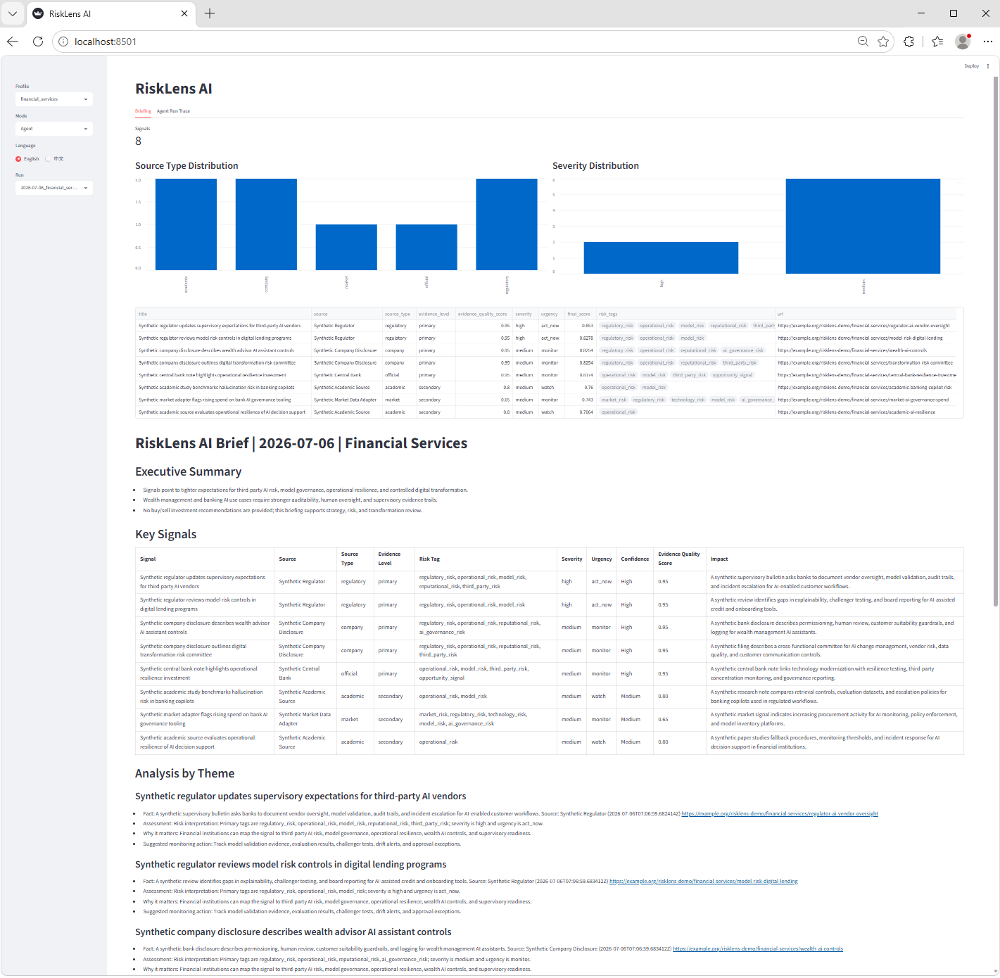
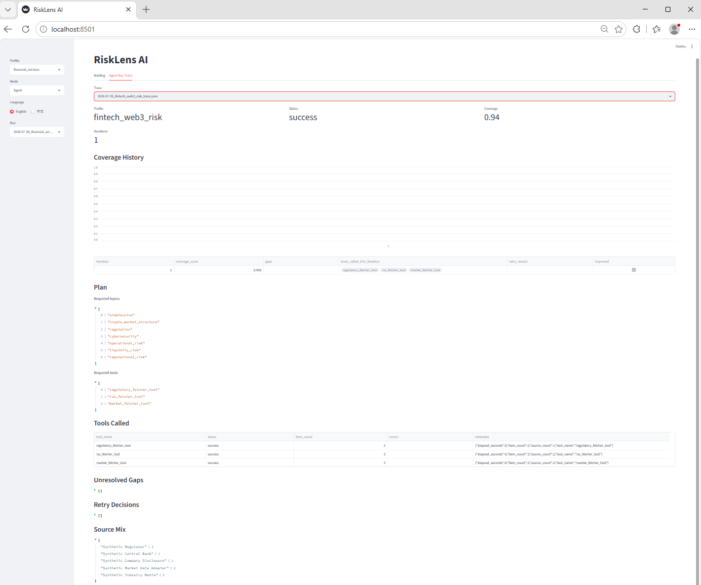

# RiskLens AI：风险感知型市场与技术情报智能体


当前版本：**V0.2.0**

RiskLens AI 是一个受控、可调用工具的公开来源风险情报智能体，覆盖金融服务、FinTech/Web3 风险和 AI 技术战略等方向。

它将确定性风险情报流水线与可审计的编排层结合起来。流水线负责采集、标准化、去重、来源可靠性评分、主题分类、风险标签、证据质量评分、严重性和紧迫性分类、排序以及报告生成。智能体编排层负责 profile-specific planning、工具选择、覆盖率评估、有边界的重试、轻量记忆、验证和 execution trace。

RiskLens AI 不是投资建议。不是交易建议。也不是法律、合规或财务建议。

## 覆盖方向

- 金融服务、银行 AI、财富管理、RegTech 和数字化转型
- FinTech、Web3、稳定币、市场结构、网络安全、流动性和声誉风险
- AI 技术战略、企业 AI agents、模型治理、AI safety 和基础设施风险
- 公开来源情报分析、风险监控和管理层简报生成

## Pipeline Mode vs Agent Mode

- `run`：确定性 pipeline 模式。它采集或加载信息，运行风险情报流水线，并生成英文和中文报告。
- `agent-run`：受控 agent 模式。它会生成 profile-specific plan，选择工具，评估覆盖缺口，在固定迭代上限内重试，验证证据，写入 memory，保存报告，并生成 execution trace。

## 架构


## Windows 快速开始

打开 PowerShell，在包含 `RiskLens_AI` 的目录下执行：

```powershell
cd D:\CodexWork\RiskLens_AI
python -m venv .venv
Set-ExecutionPolicy -Scope Process -ExecutionPolicy Bypass
.venv\Scripts\activate
python -m pip install -e ".[dev]"
python -m risklens.main validate
python -m risklens.main agent-run --profile financial_services --mock --as-of 2026-07-06 --output-root .tmp/demo
```

`--as-of` 用于固定报告日期、文件名和 recency 排序。`--output-root` 用于把运行时文件隔离到 `.tmp/demo` 这样的临时目录下。

## 常用命令

运行确定性 mock pipeline：

```powershell
python -m risklens.main run --profile financial_services --mock --as-of 2026-07-06 --output-root .tmp/demo
```

运行受控 agent 模式：

```powershell
python -m risklens.main agent-run --profile financial_services --mock --max-iterations 3 --as-of 2026-07-06 --output-root .tmp/demo
```

运行 coverage gap / retry 演示：

```powershell
python -m risklens.main agent-run --profile financial_services --mock --max-iterations 3 --simulate-gap --as-of 2026-07-06 --output-root .tmp/demo
```

刷新 curated sample artifacts：

```powershell
python -m risklens.main agent-run --profile financial_services --mock --max-iterations 3 --simulate-gap --as-of 2026-07-06 --output-root .tmp/sample-refresh --copy-samples
```

运行完整本地 demo 流程：

```powershell
python scripts/run_demo.py
```

PowerShell wrapper：

```powershell
.\scripts\run_demo.ps1
```

## 本地验证

```powershell
ruff check .
python scripts/verify_line_endings.py
python -m compileall src tests scripts
mypy src/risklens
pytest
python -m risklens.main validate
python scripts/run_demo.py
python -m build
```

所有检查都应通过。随着测试覆盖增加，pytest 的具体数量可能变化。

## 输出文件

当使用 `--output-root .tmp/demo` 时，运行时文件会写入：

- `.tmp/demo/data/raw/`：采集到的原始候选信息
- `.tmp/demo/data/processed/`：归一化、评分、打标签和排序后的信息
- `.tmp/demo/data/memory/memory.json`：轻量 run/source/item memory
- `.tmp/demo/reports/markdown/`：英文和中文 Markdown 简报
- `.tmp/demo/reports/html/`：英文和中文 HTML 简报
- `.tmp/demo/reports/traces/`：可审计的 agent execution trace

稳定样例保存在：

- `examples/sample_reports/`
- `examples/sample_traces/`
- `examples/sample_outputs/`

`.tmp/`、`data/processed/`、`data/raw/`、`data/memory/`、`reports/`、`dist/` 和 `build/` 等运行或构建产物不会提交到 Git。

## Execution Trace

trace 是执行轨迹，不是隐藏推理链。它记录 plan、工具调用、覆盖率评分、每轮 coverage history、检测到的 gaps、retry decisions、source mix、errors 和输出路径。

curated gap/retry 样例：

```text
examples/sample_traces/financial_services_gap_trace.json
```

## 启动 Dashboard

至少生成一份报告后执行：

```powershell
streamlit run src\risklens\dashboard\app.py
```

打开 Streamlit 打印的本地地址，通常是 `http://localhost:8501`。

Dashboard 页面：

- `Briefing`：处理后的信息、来源元数据、证据质量、severity、urgency、final score，以及英文/中文报告切换。
- `Agent Run Trace`：agent 状态、coverage history、计划主题、工具调用、未解决 gaps、retry decisions、source mix 和生成报告路径。

## 截图

### Dashboard Briefing 页面



### Agent Run Trace 页面



Agent Run Trace 截图展示的是一次成功运行。用于展示 coverage gap detection 和 retry behavior 的样例 trace 保存在 `examples/sample_traces/financial_services_gap_trace.json`。

## Demo Profiles

- `financial_services`：银行 AI、财富管理、监管政策、运营韧性、模型风险和数字化转型。
- `fintech_web3_risk`：稳定币、加密资产市场结构、监管、网络安全、运营风险、流动性风险和声誉风险。
- `ai_technology_strategy`：模型提供商、AI agents、企业 AI、AI 基础设施、模型治理、AI safety 和技术风险。

## 评分公式

```text
final_score =
  0.24 * authority_score
+ 0.20 * relevance_score
+ 0.16 * recency_score
+ 0.12 * risk_or_opportunity_score
+ 0.10 * novelty_score
+ 0.10 * evidence_quality_score
+ 0.08 * severity_score
- duplication_penalty
```

证据质量评分会存储在每个 item 上。`severity_score` 来自规则化严重性标签（`low`、`medium`、`high`）。

## 边界说明

- 不是投资建议。
- 不是交易建议。
- 不是自动交易工具。
- 不是完全自主 agent。
- 不处理私人数据或内部数据。
- mock data 是 synthetic demo data。
- real mode 依赖公开来源可用性、RSS 行为、网络访问和 parser 兼容性。

如果公开来源失败或覆盖不完整，agent mode 会在 trace 中记录失败原因，并可能返回带有 coverage limitations 的 `partial_success`。

## 可选 LLM 模式

Mock 模式是确定性的，不需要 API Key。如果要接入 OpenAI-compatible provider，可以复制 `.env.example` 为 `.env`，填写 provider 信息，安装可选依赖，然后运行不带 `--mock` 的命令。

```powershell
python -m pip install -e ".[llm]"
copy .env.example .env
```

然后编辑 `.env`：

```text
OPENAI_API_KEY=your_api_key_here
OPENAI_BASE_URL=https://api.openai.com/v1
OPENAI_MODEL=gpt-4.1-mini
RISKLENS_USE_LLM=true
```

## 项目文件

- `LICENSE`：MIT License
- `CHANGELOG.md`：版本变更记录
- `.gitattributes`：LF 行尾策略
- `.github/workflows/tests.yml`：CI 工作流，覆盖测试、lint、配置验证、CLI smoke run 和 package build

## 常见问题

如果 PowerShell 阻止虚拟环境激活，执行：

```powershell
Set-ExecutionPolicy -Scope Process -ExecutionPolicy Bypass
.venv\Scripts\activate
```

如果 `python -m risklens.main ...` 提示找不到包，执行：

```powershell
python -m pip install -e ".[dev]"
```

如果 dashboard 打开后没有数据，请先用上面的 `--mock` 命令生成至少一份报告。
