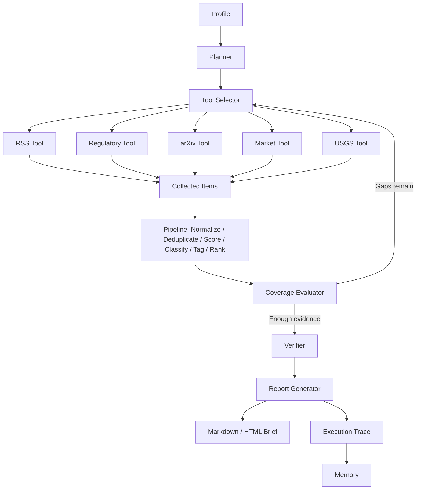

# RiskLens AI：风险感知型市场与技术情报智能体


RiskLens AI 是一个受控、可调用工具的情报智能体，面向金融服务、FinTech/Web3 风险和 AI 技术战略等场景。

它将确定性风险情报流水线与可审计的 agentic 编排层结合起来。流水线负责采集、标准化、去重、来源可靠性评分、主题分类、风险标签、证据质量评分、严重性/紧迫性分类、排序和报告生成。agentic 编排层负责 profile-specific planning、工具选择、覆盖率评估、重试逻辑、轻量记忆、验证和 execution trace。

RiskLens AI 不提供投资建议、交易建议或自主金融决策。它用于公开来源情报分析、风险监控和管理层简报生成。

## 覆盖领域

- 金融服务与数字化转型
- FinTech、Web3 与风险数据分析
- AI 应用自动化
- 数据分析与商业智能
- 风险监控与 RegTech

## Pipeline Mode vs Agent Mode

- `run`：确定性 pipeline 模式。它采集或加载信息，运行风险情报流水线，并生成英文和中文报告。
- `agent-run`：受控 agentic 编排模式。它会生成 profile-specific plan，选择工具，评估覆盖缺口，在固定迭代上限内重试，验证证据，保存报告，写入 memory，并生成 execution trace。

## 架构



## Windows 快速开始

打开 PowerShell，在包含 `RiskLens_AI` 的目录下执行：

```powershell
cd D:\CodexWork\RiskLens_AI
python -m venv .venv
Set-ExecutionPolicy -Scope Process -ExecutionPolicy Bypass
.venv\Scripts\activate
pip install -e .
pytest
```

所有测试应通过；当前 demo 版本通常显示 `32 passed`。

## 本地演示脚本

安装项目后，可以运行核心本地演示流程：

```powershell
.\scripts\run_demo.ps1
```
## Pipeline 命令

使用 mock 数据运行确定性 pipeline：

```powershell
python -m risklens.main run --profile financial_services --mock
```

其他 profile：

```powershell
python -m risklens.main run --profile fintech_web3_risk --mock
python -m risklens.main run --profile ai_technology_strategy --mock
```

非 mock pipeline 模式会调用 fetcher adapters，而不是 `mock_items()`：

```powershell
python -m risklens.main run --profile financial_services
```

## Agent 命令

使用确定性 mock tools 运行受控 agent 模式：

```powershell
python -m risklens.main agent-run --profile financial_services --mock --max-iterations 3
```

运行其他 profile：

```powershell
python -m risklens.main agent-run --profile ai_technology_strategy --mock
```

命令会打印生成路径和 agent 状态：

```text
raw: ...\data\raw\YYYY-MM-DD_financial_services_agent.json
processed: ...\data\processed\YYYY-MM-DD_financial_services_agent.json
markdown_en: ...\reports\markdown\YYYY-MM-DD_financial_services_agent_en.md
markdown_zh: ...\reports\markdown\YYYY-MM-DD_financial_services_agent_zh.md
html_en: ...\reports\html\YYYY-MM-DD_financial_services_agent_en.html
html_zh: ...\reports\html\YYYY-MM-DD_financial_services_agent_zh.html
trace: ...\reports\traces\YYYY-MM-DD_financial_services_trace.json
status: success
coverage_score: 0.88
```

## 输出文件

- `reports/markdown/*_en.md`：英文 Markdown 简报
- `reports/markdown/*_zh.md`：中文 Markdown 简报
- `reports/html/*_en.html`：英文 HTML 简报
- `reports/html/*_zh.html`：中文 HTML 简报
- `data/raw/*.json`：采集到的原始候选信息
- `data/processed/*.json`：归一化、评分、打标签和排序后的信息
- `reports/traces/*_trace.json`：可审计的 agent execution trace
- `data/memory/memory.json`：轻量 run/source/item memory

## Execution Trace 示例

```json
{
  "run_id": "agent-2026-07-05-demo1234",
  "profile": "financial_services",
  "status": "success",
  "iteration_count": 2,
  "coverage_score": 0.969,
  "coverage_history": [
    {
      "iteration": 1,
      "coverage_score": 0.859,
      "gaps": [
        "Missing academic source evidence."
      ],
      "tools_called_this_iteration": [
        "regulatory_fetcher_tool",
        "rss_fetcher_tool",
        "market_fetcher_tool",
        "arxiv_fetcher_tool"
      ],
      "retry_reason": "Iteration 1: coverage score 0.86; calling arxiv_fetcher_tool to address gaps: Missing academic source evidence.",
      "improved": true
    },
    {
      "iteration": 2,
      "coverage_score": 0.969,
      "gaps": [],
      "tools_called_this_iteration": [
        "arxiv_fetcher_tool"
      ],
      "retry_reason": "",
      "improved": true
    }
  ],
  "retry_decisions": [
    "Iteration 1: coverage score 0.86; calling arxiv_fetcher_tool to address gaps: Missing academic source evidence."
  ],
  "source_mix": {
    "Synthetic Regulator": 2,
    "Synthetic Company Disclosure": 2,
    "Synthetic Academic Source": 2,
    "Synthetic Central Bank": 1,
    "Synthetic Market Data Adapter": 1
  }
}
```

该 trace 是执行轨迹，不是隐藏推理链。它记录计划、工具调用、覆盖缺口、重试决策、来源结构和输出路径，用于审计和复现。

## 启动 Dashboard

至少生成一份报告后，启动 Streamlit dashboard：

```powershell
streamlit run src\risklens\dashboard\app.py
```

打开 Streamlit 打印的本地地址，通常是 `http://localhost:8501`。Dashboard 包含：

- `Briefing`：处理后的信息、来源元数据、评分、severity、urgency，以及英文/中文报告切换。
- Mode selector：可选择 `Pipeline`、`Agent` 或 `All` 输出。
- `Agent Run Trace`：agent 状态、覆盖率、coverage history、迭代次数、计划主题、工具调用、未解决缺口、重试决策、来源结构和生成报告路径。

## Demo Profiles

- `financial_services`：金融服务中的 AI、监管与政策信号、银行、财富管理、RegTech、运营韧性和数字化转型。
- `fintech_web3_risk`：加密资产/Web3 市场结构、稳定币、监管、运营风险、网络安全风险、流动性风险和声誉风险。
- `ai_technology_strategy`：模型提供商、AI agents、企业 AI 采用、AI 基础设施、模型风险、AI safety 和治理。

## 可选 LLM 模式

本地演示推荐使用 mock 模式，不需要 API Key。如果要接入 OpenAI-compatible provider，可以复制 `.env.example` 为 `.env`，填写 provider 信息，安装可选依赖，然后运行不带 `--mock` 的命令。

```powershell
pip install -e .[llm]
copy .env.example .env
```

然后编辑 `.env`。


## Mock 数据与演示行为

Mock 模式使用明确标记为 synthetic 的业务化演示信号，仅用于本地演示和测试。这些数据使用差异化来源，例如 Synthetic Regulator、Synthetic Central Bank、Synthetic Company Disclosure、Synthetic Academic Source、Synthetic Industry Media 和 Synthetic Market Data Adapter。

Real mode 依赖公开来源可用性、RSS feed 行为、网络访问和解析兼容性。如果部分公开来源失败或覆盖不完整，agent mode 会返回 `partial_success` 和 coverage limitations，而不是让整次运行直接失败。

## 模拟重试演示

使用 `--simulate-gap` 可以演示受控重试循环。第一轮会故意遗漏一种证据类型，evaluator 检测到缺口后，orchestrator 会调用推荐的下一步工具。

```powershell
python -m risklens.main agent-run --profile financial_services --mock --max-iterations 3 --simulate-gap
```

生成的 trace 会包含 `coverage_history` 和 `retry_decisions`，方便查看和审计重试行为。

## 截图

后续可以补充截图，用于展示：
- Dashboard Briefing 页面；
- Agent Run Trace 页面；
- 包含来源类型、证据等级、严重性、紧迫性和置信度的 HTML 简报。
## 为什么这些方向重要

- 金融服务：将 AI 供应商、模型治理、运营韧性和监管监督信号转化为结构化监控输出。
- FinTech/Web3 风险：组织稳定币储备、托管、网络安全、流动性、执法和声誉风险信号，同时避免输出交易建议。
- AI 转型：把企业 agent 治理、模型评估、AI 基础设施成本、平台依赖和 AI safety 连接到决策支持简报。
## 数据来源原则

- 官方、监管机构和公司披露信息拥有最高权威性评分。
- 学术和政府数据拥有较高权威性评分。
- 高质量媒体可作为辅助信号，但最终报告中单一来源不应占比过高。
- 博客和社交媒体应视为低权威来源，除非有其他证据交叉验证。
- 付费墙内容、私人数据和内部数据不在项目范围内。

## 评分公式

```text
final_score =
  0.24 * authority_score
+ 0.20 * relevance_score
+ 0.16 * recency_score
+ 0.12 * risk_or_opportunity_score
+ 0.10 * novelty_score
+ 0.10 * evidence_quality_score
+ 0.08 * severity_score
- duplication_penalty
```

`severity_score` 由规则化的严重性标签（`low`、`medium`、`high`）转换得到。

## 常见问题

如果 `python -m risklens.main ...` 提示找不到包，请确认已经在激活虚拟环境后，在项目目录内执行过 `pip install -e .`。

如果 PowerShell 阻止激活脚本，可以在当前 shell 中执行一次：

```powershell
Set-ExecutionPolicy -Scope Process -ExecutionPolicy Bypass
.venv\Scripts\activate
```

如果 dashboard 打开后没有数据，请先用上面的 `--mock` 命令生成至少一份报告。